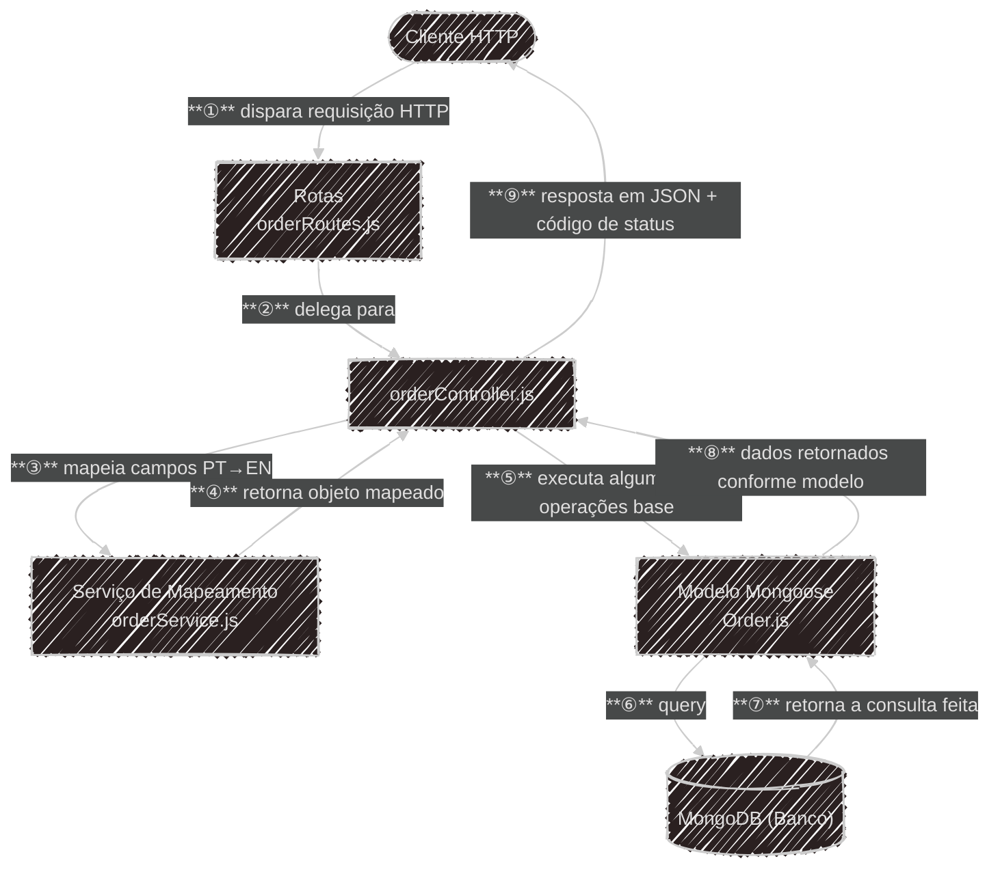

# order-api-management
API para gerenciamento de pedidos em Node.js com MongoDB.

## 📗 Pré-requisitos

|Aplicação|Versão|Função|
|---|---|---|
|Node.js|20+|Runtime|
|Express|5.x|Framework HTTP|
|Mongoose|9.x|ODM MongoDB|
|MongoDB|8.x|Banco de dados|
|dotenv|17.x|Variáveis de ambiente|
|swagger-ui|6.x|Documentação e testes HTTP via browser

## 📘 Instalação
```bash
# 1. clone o repositório
git clone https://github.com/wrtluigi/order-api-management.git
cd order-api-management

# 2. instale dependências
npm install

# 3. configure a variável de ambiente (.env com suas configurações locais)
cp .env.example .env

# 4. inicie a aplicação
node src/app.js
```
### 📒 Operações Base
| Método   | URL           | Descrição               | Status        |
| -------- | ------------- | ----------------------- | ------------- |
| `POST`   | `/order`      | Criar pedido            | `201` / `500` |
| `GET`    | `/order/:id`  | Buscar pedido por ID    | `200` / `500` |
| `GET`    | `/order/list` | Listar todos os pedidos | `200` / `500` |
| `PUT`    | `/order/:id`  | Atualizar pedido        | `200` / `500` |
| `DELETE` | `/order/:id`  | Remover pedido          | `204` / `500` |

### 🔖 Melhorias Futuras
- Autenticação JWT
- Testes Automatizados
- Deploy em Nuvem
  
## 📕 Falando sobre a Arquitetura/API



