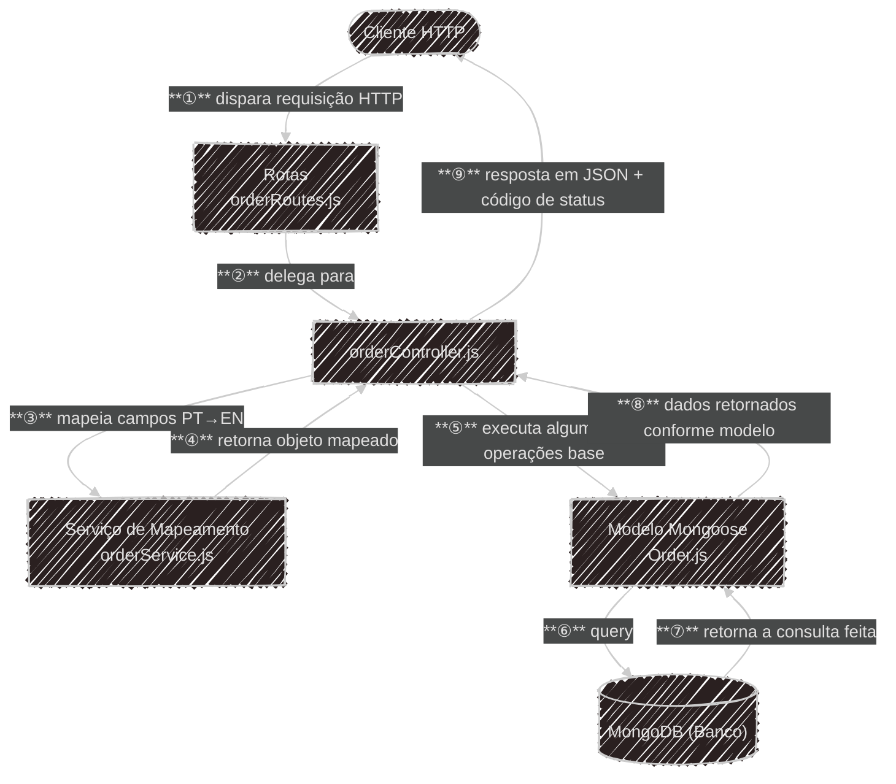

# order-api-management
API para gerenciamento de pedidos em Node.js com MongoDB.

```mermaid
---
config:
  theme: neo-dark
  layout: dagre
  look: handDrawn
---
flowchart TB
    Client(["Cliente HTTP"])
    Routes["Rotas\norderRoutes.js"]
    Controller["orderController.js"]
    Service["Serviço de Mapeamento\norderService.js"]
    Model["Modelo Mongoose\nOrder.js"]
    DB[("MongoDB (Banco)")]

    Client -- "**①** dispara requisição HTTP" --> Routes
    Routes -- "**②** delega para" --> Controller
    Controller -- "**③** mapeia campos PT→EN" --> Service
    Service -- "**④** retorna objeto mapeado" --> Controller
    Controller -- "**⑤** executa alguma das 5 operações base" --> Model
    Model -- "**⑥** query" --> DB
    DB -- "**⑦** retorna a consulta feita" --> Model
    Model -- "**⑧** dados retornados conforme modelo" --> Controller
    Controller -- "**⑨** resposta em JSON + código de status" --> Client
```
